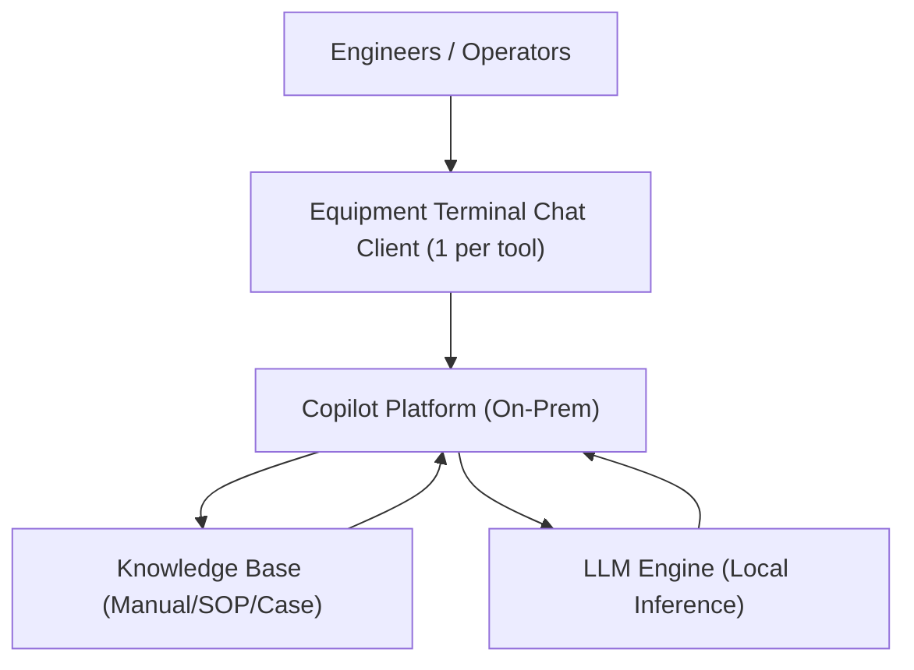
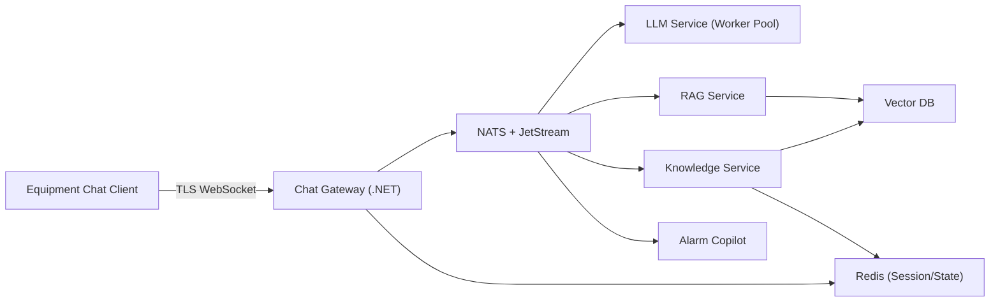
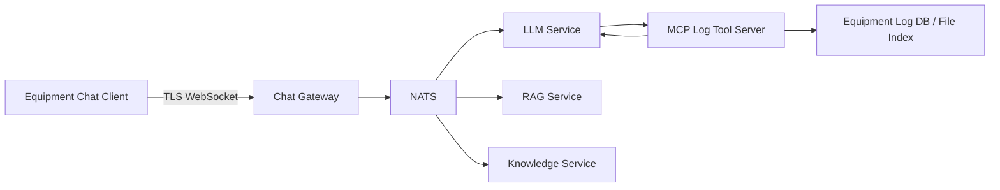
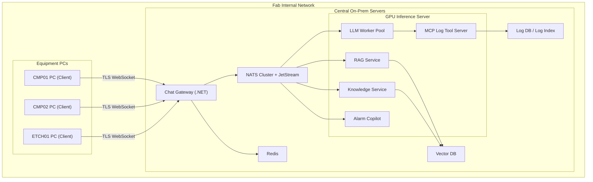
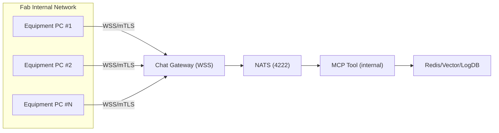
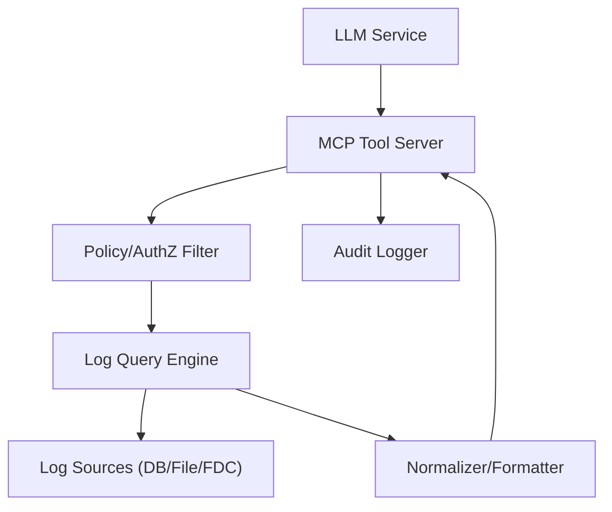
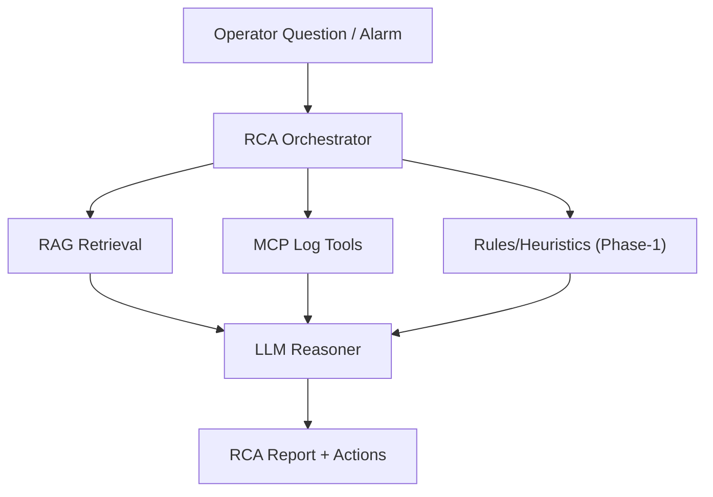
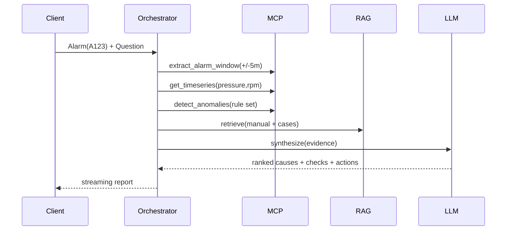
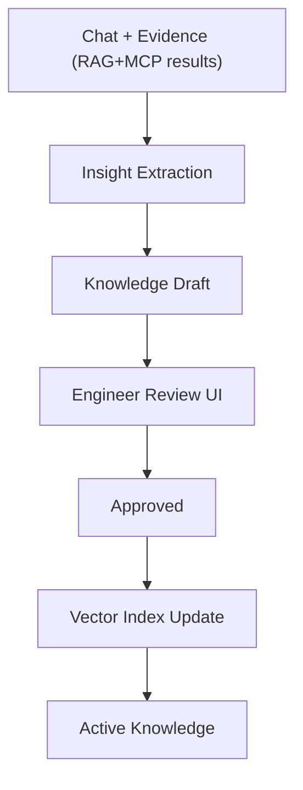
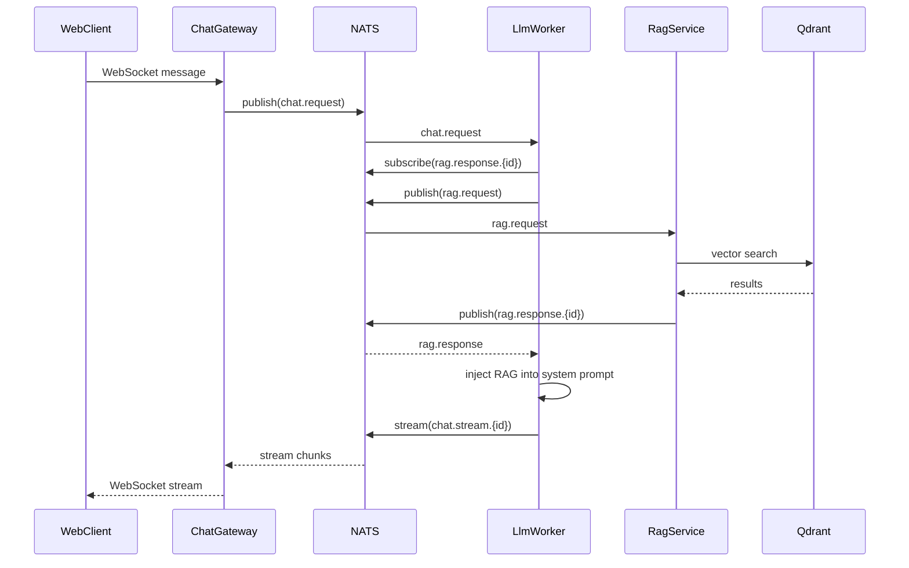

# Fab On-Prem LLM Equipment Copilot System  
## Architecture + Detailed Design + MCP Log Analysis (Full Spec)

> 목적: Fab 내부(On-Prem)에서 **장비 단말(Equipment Terminal) 1:1 Chat Client**를 통해 중앙 Copilot 플랫폼(LLM+RAG+이벤트)을 제공하고, **운영 경험(채팅 기록) + 장비 로그**를 지식으로 축적하여 Copilot 성능이 시간이 지날수록 향상되는 시스템을 구축한다.  
> 본 문서는 **아키텍처(다이어그램 포함) + MCP 로그 기능 + 데이터/메시지/보안/운영 설계 + RCA Agent 설계 + CMP 특화**까지 포함한다.

---

## 0. 문서 버전
- Version: 1.1
- Date: 2026-02-19
- Scope: Architecture Design + Implementation Spec (SDS-lite)
- Changes: RAG 파이프라인 연결 완료, 구현 현황 섹션 추가, NATS RAG 토픽 추가

---

# 1. Requirements

## 1.1 Functional Requirements

### Chat / Copilot
- 장비 단위 Chat 세션(Equipment-centric)
- WebSocket 기반 양방향 통신 + 토큰 스트리밍
- 장비 Context 자동 첨부(장비ID, 모듈, 레시피, 공정상태, 최근 알람 등)
- 대화 이력 저장 및 재조회

### Knowledge / RAG
- Manual/SOP/Troubleshooting/RCA 문서 검색
- 운영 중 문서 지속 추가(재학습 없이 인덱싱만으로 반영)
- 채팅 기록에서 Knowledge 후보 자동 추출 + 검토/승인 후 지식화

### Event / Alarm
- Alarm 이벤트 수신 및 자동 분석(Copilot)
- 알람 전후 로그(윈도우) 자동 추출 및 요약

### MCP 기반 로그 검색/추출/분석 (추가)
- 장비 내부/장비 인접 서버의 로그 DB(또는 파일)를 **MCP Tool**로 안전하게 조회
- 검색/필터/윈도우 추출/요약/시계열 다운샘플링
- 분석 결과를 RCA 파이프라인 및 Knowledge 축적에 연계

---

## 1.2 Non-Functional Requirements

- Latency: 평균 응답 < 2s (RAG+LLM), 스트리밍 토큰 첫 응답 < 100ms 목표
- Availability: 24/7 운영, 장애 복구/재시작 용이
- Security: 내부망 only, TLS/mTLS, 장비ID 기반 인증, 감사로그(Audit)
- Scalability: 장비 50+, 장비당 1 client, 동시 질의 처리 (worker pool)

---

# 2. Architecture (Mermaid)

## 2.1 System Context



## 2.2 Logical Architecture (Core)



## 2.3 MCP Log Tool Added (Updated Logical Architecture)



## 2.4 Deployment Architecture



## 2.5 Network Topology



---

# 3. Messaging & Topics (NATS)

## 3.1 Topic Convention

- Equipment-scoped topics:
  - `equipment.<toolId>.chat.request`
  - `equipment.<toolId>.chat.stream`
  - `equipment.<toolId>.alarm.triggered`
  - `equipment.<toolId>.log.anomaly`
- Platform topics:
  - `chat.request`
  - `chat.stream.<conversationId>`
  - `rag.request`
  - `rag.response.<conversationId>`
  - `knowledge.extract.request`
  - `knowledge.extract.result`
  - `mcp.log.query.request`
  - `mcp.log.query.result`
  - `rca.run.request`
  - `rca.run.result`

## 3.2 Message Envelope (권장)

```json
{
  "type": "chat.request",
  "traceId": "uuid",
  "timestamp": "2026-02-18T10:00:00+09:00",
  "equipmentId": "CMP01",
  "payload": { }
}
```

---

# 4. Data Models

## 4.1 Conversation Model (Storage)

- Key: `conv:{conversationId}`
- Fields:
  - `equipmentId`
  - `createdAt`
  - `lastUpdatedAt`
  - `messages[]` (role, text, attachments, toolResults references)

Example:

```json
{
  "conversationId": "c-001",
  "equipmentId": "CMP01",
  "messages": [
    {"role":"user","text":"A123 알람 원인?","time":"..."},
    {"role":"assistant","text":"가능 원인...","time":"..."}
  ]
}
```

## 4.2 Knowledge Object Model

```json
{
  "id": "k-001",
  "type": "troubleshooting",
  "equipment": "CMP01",
  "module": "Head",
  "symptom": "pressure oscillation",
  "rootCause": "pad glazing",
  "solution": "pad conditioning",
  "evidence": ["logWindowRef:lw-778", "manualRef:doc-12#p33"],
  "confidence": 0.90,
  "status": "Approved",
  "version": 3,
  "approvedBy": "process_team",
  "approvedAt": "2026-02-18T11:20:00+09:00"
}
```

## 4.3 Log Data Model (MCP용 Canonical Schema)

### 4.3.1 LogRecord

```json
{
  "ts": "2026-02-18T10:05:21.123+09:00",
  "equipmentId": "CMP01",
  "module": "Head",
  "level": "INFO",
  "channel": "Trace",
  "event": "PressureUpdate",
  "fields": {
    "zone": 7,
    "pressure_kpa": 32.4,
    "rpm": 87.2
  },
  "raw": "optional raw line or pointer"
}
```

### 4.3.2 TimeSeriesFrame (Downsampled)

```json
{
  "equipmentId": "CMP01",
  "signals": ["pressure_kpa","rpm"],
  "start": "2026-02-18T10:00:00+09:00",
  "end": "2026-02-18T10:10:00+09:00",
  "stepMs": 200,
  "data": [
    {"ts":"...","pressure_kpa":31.9,"rpm":86.8},
    {"ts":"...","pressure_kpa":32.1,"rpm":86.9}
  ],
  "quality": {"missingRatio": 0.01, "interpolated": true}
}
```

### 4.3.3 AlarmWindow

```json
{
  "alarmCode": "A123",
  "equipmentId": "CMP01",
  "triggeredAt": "2026-02-18T10:07:00+09:00",
  "windowBeforeSec": 300,
  "windowAfterSec": 300,
  "recordsRef": "lw-778"
}
```

---

# 5. MCP Log Tooling (1 + 2 + 3)

## 5.1 MCP Server 내부 컴포넌트



## 5.2 Tool List

- `search_logs`
- `extract_time_window`
- `extract_alarm_window`
- `summarize_logs`
- `get_timeseries`
- `detect_anomalies` (Phase-1 rule 기반)

## 5.3 Tool Schemas

### search_logs (Input/Output)
```json
{
  "tool": "search_logs",
  "equipmentId": "CMP01",
  "query": "A123 OR PressureUpdate",
  "startTime": "2026-02-18T10:00:00+09:00",
  "endTime": "2026-02-18T10:10:00+09:00",
  "level": ["WARN","ERROR"],
  "module": ["Head","Slurry"],
  "limit": 500
}
```

```json
{
  "records": [ { "ts":"...", "event":"...", "fields":{ } } ],
  "nextCursor": "optional",
  "stats": { "matched": 1320, "returned": 500, "tookMs": 48 }
}
```

### extract_alarm_window (Input/Output)
```json
{
  "tool": "extract_alarm_window",
  "equipmentId": "CMP01",
  "alarmCode": "A123",
  "triggeredAt": "2026-02-18T10:07:00+09:00",
  "beforeSec": 300,
  "afterSec": 300,
  "channels": ["Alarm","Trace"]
}
```

```json
{
  "alarmWindow": {
    "alarmCode": "A123",
    "triggeredAt": "...",
    "windowBeforeSec": 300,
    "windowAfterSec": 300,
    "recordsRef": "lw-778"
  }
}
```

### get_timeseries (Input)
```json
{
  "tool": "get_timeseries",
  "equipmentId": "CMP01",
  "signals": ["pressure_kpa","rpm"],
  "startTime": "2026-02-18T10:00:00+09:00",
  "endTime": "2026-02-18T10:10:00+09:00",
  "stepMs": 200,
  "aggregation": "mean"
}
```

### summarize_logs (Output 예)
```json
{
  "summary": "알람 전 2분부터 Zone7 압력이 0.8Hz로 진동하며...",
  "highlights": [
    {"ts":"...","event":"PressureUpdate","note":"oscillation starts"},
    {"ts":"...","event":"Alarm","note":"A123 triggered"}
  ],
  "signals": {
    "pressure_kpa": {"trend":"oscillating","peakToPeak":1.8},
    "rpm": {"trend":"stable"}
  }
}
```

## 5.4 MCP Security/Policy

- 장비 scope 강제(인증된 Device Identity ↔ equipmentId 매칭)
- time range cap (예: 최대 2시간)
- maxRecords cap + paging
- timeout (예: 2~5초)
- 민감 필드 마스킹
- 모든 tool call audit 기록(traceId 포함)

---

# 6. RCA Agent Design (4)

## 6.1 RCA Agent 아키텍처



## 6.2 RCA Workflow (Sequence)



---

# 7. CMP-Specific Log Analysis (5)

## 7.1 CMP 신호 카탈로그(예)

| Category | Signals (예) | Note |
|---|---|---|
| Head Pressure | zone1..zoneN pressure, total pressure | zone 불균형/진동 |
| Platen/Carrier | platen rpm, carrier rpm, torque | 마찰 변화 |
| Slurry | flow, temp, conductivity | 슬러리 이슈 |
| Conditioner | arm position, rpm, downforce | pad glazing 연관 |
| Removal/EPD | endpoint markers, spectra stats | 공정 종료/이상 |

## 7.2 CMP 패턴 라이브러리(Phase-1)

- Pressure oscillation: 0.5~2Hz 대역 peak-to-peak 증가
- Pressure drift: slope 증가/감소
- Torque jump: torque step 상승
- Slurry starvation: flow 감소 + torque 증가
- Pad glazing hint: (pressure oscillation + removal rate 감소 + conditioner 이벤트 변화)

## 7.3 CMP 전용 MCP 도구 확장(옵션)

- `cmp_compare_zone_balance`
- `cmp_correlate_pressure_torque`

예) `cmp_compare_zone_balance`

```json
{
  "tool":"cmp_compare_zone_balance",
  "equipmentId":"CMP01",
  "startTime":"2026-02-18T10:00:00+09:00",
  "endTime":"2026-02-18T10:10:00+09:00",
  "zones":[1,2,3,4,5,6,7,8,9,10,11]
}
```

```json
{
  "imbalanceScore": 0.71,
  "worstZones":[7,8],
  "notes":"Zone7/8 변동성이 다른 존 대비 2.3배"
}
```

---

# 8. Knowledge Learning 연결 (Chat → Knowledge)



---

# 9. Implementation Status

## 9.1 구현 완료

| 항목 | 상태 | 비고 |
|---|---|---|
| Chat Gateway (WebSocket) | ✅ 완료 | port 5000, `/ws/chat/{equipmentId}` |
| LLM Service (Worker Pool) | ✅ 완료 | NATS `chat.request` 구독, Ollama 스트리밍 |
| RAG Service (Vector Search) | ✅ 완료 | NATS `rag.request` 구독, Qdrant 검색 |
| **RAG → LLM 파이프라인 연결** | ✅ 완료 | LlmWorker에서 RAG 호출 후 시스템 프롬프트에 주입 |
| Knowledge Service (REST API) | ✅ 완료 | 문서 등록/승인/인덱싱 워크플로 |
| RCA Agent (Orchestrator) | ✅ 완료 | RAG + MCP 증거 수집 → LLM 분석 |
| Web Client (Blazor Server) | ✅ 완료 | port 5010, Markdown + KaTeX 렌더링 |
| Redis 대화 저장 | ✅ 완료 | AbortOnConnectFail 복원력 적용 |
| Observability (Serilog + OTEL) | ✅ 완료 | 공유 라이브러리 |
| NATS Messaging | ✅ 완료 | Pub/Sub + Request/Reply 지원 |
| Vector Store (Qdrant Client) | ✅ 완료 | Upsert/Search/Delete/EnsureCollection |

## 9.2 현재 설정

| 항목 | 값 |
|---|---|
| LLM 모델 | Qwen2.5:7b (CPU, ~3-4 tok/s) |
| 임베딩 모델 | nomic-embed-text (768차원) |
| 벡터 컬렉션 | `knowledge` (Qdrant) |
| 시스템 프롬프트 | 한국어 전용, 한문 금지, Markdown + LaTeX |
| RAG 타임아웃 | 10초 (타임아웃 시 RAG 없이 동작) |

## 9.3 RAG 채팅 흐름 (구현 완료)



---

# 10. Next Steps Checklist

- [x] Chat Gateway + LLM Service 기본 채팅 흐름 구현
- [x] RAG Service 벡터 검색 구현
- [x] **RAG → LLM 파이프라인 연결 (chat.request → rag.request → 프롬프트 주입)**
- [x] Web Client Markdown + KaTeX 렌더링
- [x] 한국어 전용 시스템 프롬프트 (한문 방지)
- [ ] Knowledge Base 초기 데이터 적재 (CMP 매뉴얼/SOP)
- [ ] MCP Tool schema 확정 및 테스트 데이터로 검증
- [ ] Log source 연동 방식 선택(DB vs 파일 인덱스)
- [ ] CMP 신호 매핑 테이블 정의(장비 tag → canonical signal)
- [ ] RCA Playbook(알람 코드별) 1차 정의
- [ ] Governance UI(승인/폐기/버전) 최소 기능 구현
- [ ] 성능 벤치(대표 시나리오: A123, pressure oscillation)
- [ ] GPU 서버 배포 (현재 CPU 전용)

---
