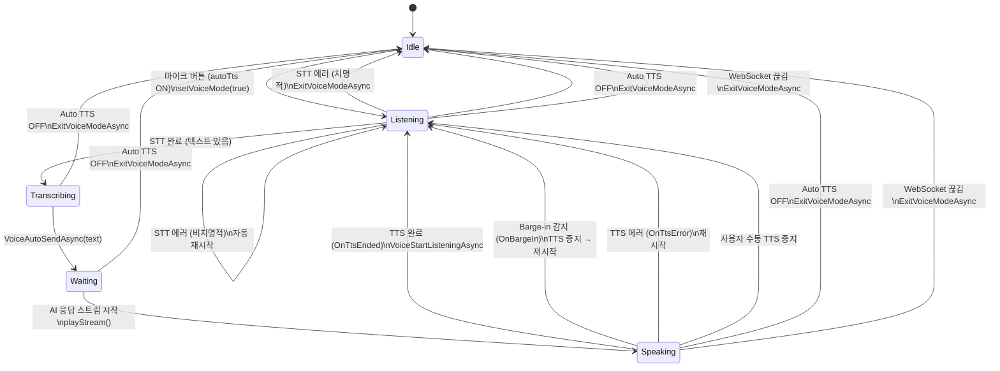
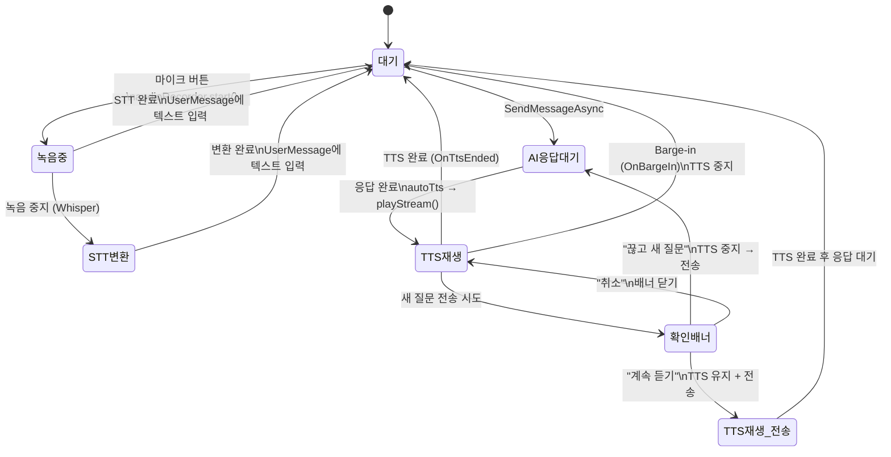
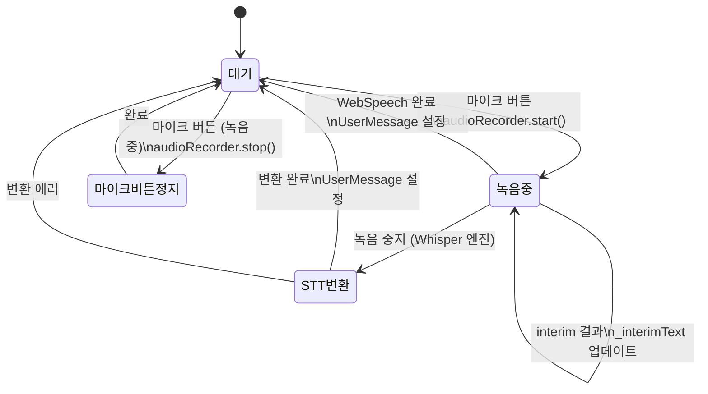
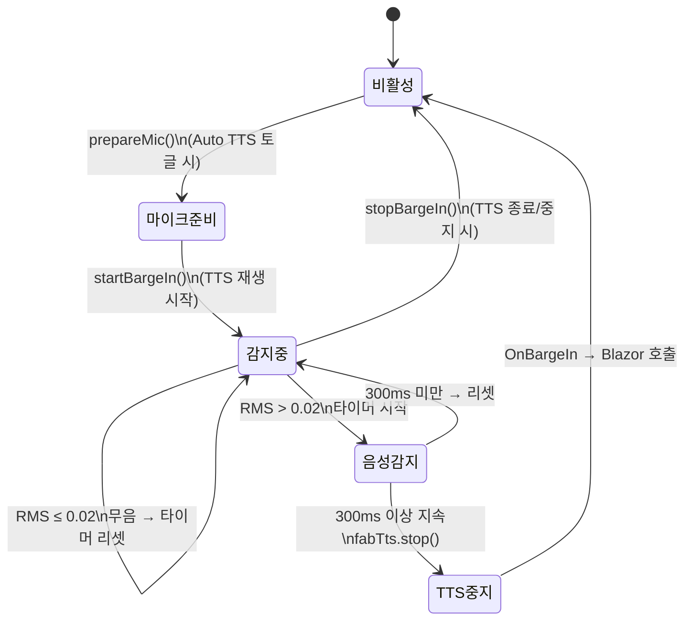
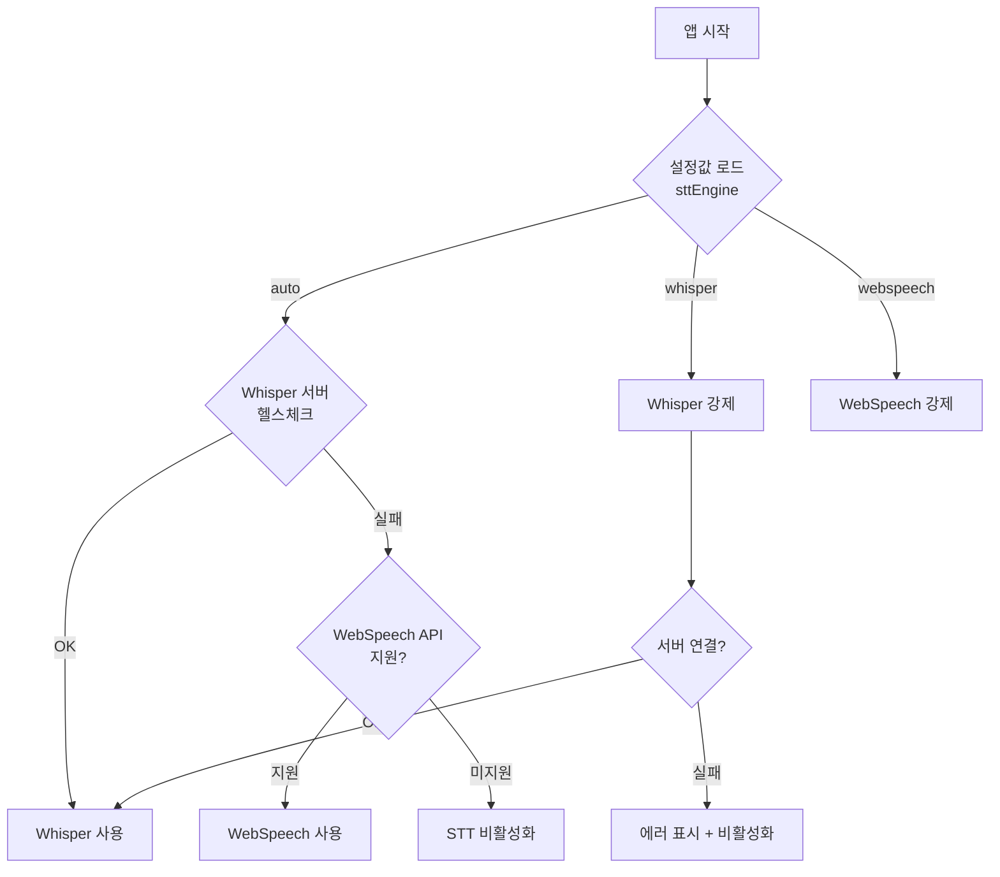
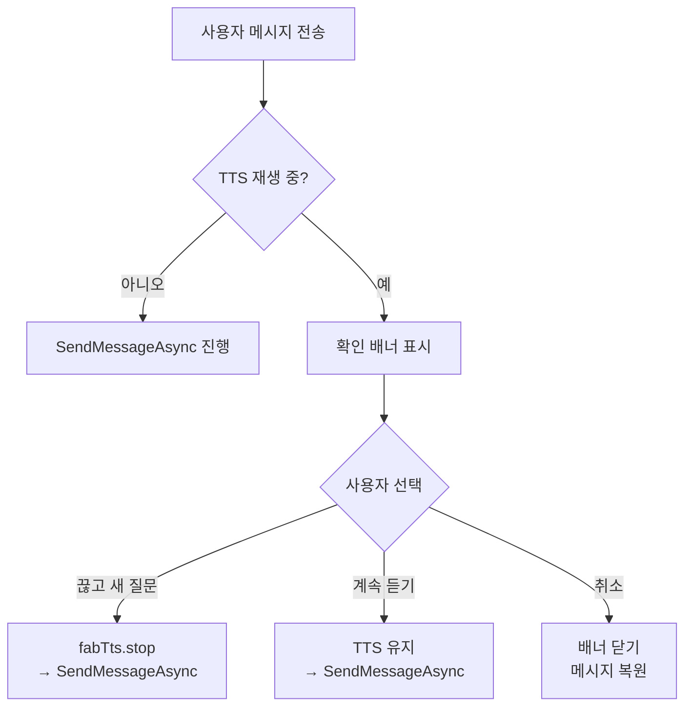
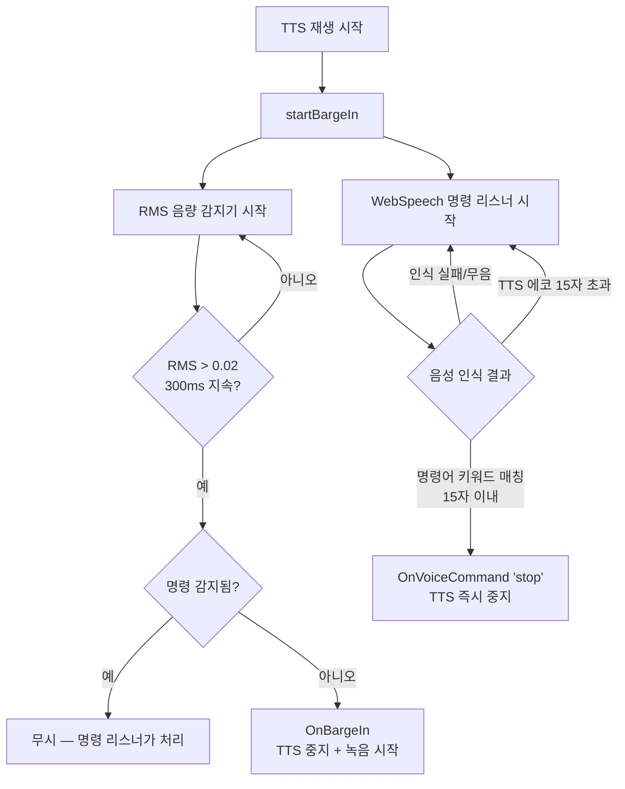

# 음성 입출력 상태 머신 (Voice I/O State Machine)

> FabWise WebClient 음성 대화 기능의 상태 관리 문서
> 대상 파일: `Index.razor`, `_Layout.cshtml`

---

## 1. 주요 상태 변수

| 변수 | 타입 | 설명 |
|---|---|---|
| `_autoTtsEnabled` | `bool` | Auto TTS 토글 (localStorage 저장) |
| `_isVoiceMode` | `bool` | 음성 대화 루프 활성 (STT→질문→TTS→반복) |
| `_voicePhase` | `VoicePhase` | 음성 모드 내 세부 단계 |
| `_isRecording` | `bool` | 마이크 녹음 중 |
| `_isTranscribing` | `bool` | STT 변환 중 (Whisper 업로드) |
| `_ttsPlayingIdx` | `int` | TTS 재생 중인 메시지 인덱스 (`-1` = 없음) |
| `_ttsStreamingActive` | `bool` | 스트리밍 TTS 진행 중 |
| `_ttsSendConfirmVisible` | `bool` | TTS 중 새 질문 확인 배너 표시 |

---

## 2. VoicePhase 열거형

```csharp
private enum VoicePhase { Idle, Listening, Transcribing, Waiting, Speaking }
```

| Phase | 의미 | UI 표시 |
|---|---|---|
| `Idle` | 비활성 | 상태 바 숨김 |
| `Listening` | 마이크 대기/녹음 중 | 녹색 맥동 아이콘 + "듣고 있습니다..." |
| `Transcribing` | STT 텍스트 변환 중 | 처리 중 애니메이션 |
| `Waiting` | AI 응답 대기 | 처리 중 애니메이션 + "응답 생성 중..." |
| `Speaking` | TTS 응답 재생 중 | 파란 스피커 아이콘 + "응답 읽는 중..." |

---

## 3. 전체 상태 전이 다이어그램

### 3-1. Voice Mode (음성 대화 루프)

`_autoTtsEnabled = true`, `_isVoiceMode = true` 일 때의 핸즈프리 루프.



### 3-2. Non-Voice Mode (일반 채팅 + Auto TTS)

`_autoTtsEnabled = true`, `_isVoiceMode = false` 일 때. 텍스트 입력 후 응답을 TTS로 읽어줌.



### 3-3. 일회성 녹음 (Auto TTS OFF)

`_autoTtsEnabled = false` 일 때. 수동 마이크 버튼으로 STT만 사용.



---

## 4. JS 레이어: Barge-in 감지 시스템

TTS 재생 중 사용자 음성을 감지하여 TTS를 중단하는 메커니즘.



### Barge-in 구성 요소

| 구성요소 | 역할 |
|---|---|
| `fabTts.prepareMic()` | Auto TTS 토글 시 마이크 사전 획득 (user gesture) |
| `fabTts.startBargeIn()` | TTS 시작 시 마이크 RMS 분석 시작 |
| `fabTts._bargeInAnalyser` | Web Audio AnalyserNode — 실시간 음량 측정 |
| RMS > 0.02 (300ms 지속) | `fabTts.stop()` + `OnBargeIn()` Blazor 호출 |
| `fabTts.stopBargeIn()` | TTS 종료 시 감지기 정리 |
| `fabTts.releaseMic()` | Auto TTS OFF 시 마이크 해제 |

### 마이크 스트림 우선순위

```
persistentStream (Voice Mode) > bargeInMicStream (Auto TTS) > 없음
```

---

## 5. STT 엔진 선택 흐름



---

## 6. TTS 재생 엔진 폴백 흐름

```mermaid
flowchart TD
    A[TTS 재생 요청] --> B{AudioContext<br/>상태?}
    B -->|suspended| C[ctx.resume()]
    B -->|running| D[서버 TTS 요청]
    C --> D

    D --> E{HTTP 응답?}
    E -->|200 + audio| F[Web Audio 재생<br/>+ Barge-in 시작]
    E -->|200 + JSON<br/>engine=Browser| G[SpeechSynthesis 재생<br/>+ Barge-in 시작]
    E -->|에러/타임아웃| H[SpeechSynthesis 폴백<br/>+ Barge-in 시작]

    F --> I[재생 완료]
    G --> I
    H --> I
    I --> J[OnTtsEnded → Blazor]
```

---

## 7. TTS 중 새 질문 확인 흐름



---

## 8. 에러 처리 정책

### STT 에러

| 에러 유형 | 분류 | 처리 |
|---|---|---|
| `aborted` | 정상 | 무시 (사용자 수동 중지) |
| `no-speech` | 비치명적 | Voice Mode: 자동 재시작 / 일반: 무시 |
| `network` | 비치명적 | Voice Mode: 자동 재시작 / 일반: 무시 |
| `not-allowed` | 치명적 | UI 에러 표시 |
| 서버 연결 실패 | 치명적 | UI 에러 표시 + Voice Mode 종료 |

### TTS 에러

| 에러 유형 | 처리 |
|---|---|
| 서버 TTS 실패 | SpeechSynthesis 폴백 |
| SpeechSynthesis 실패 | `OnTtsError` → Voice Mode: 재시작 / 일반: 무시 |
| AudioContext suspended | `resume()` 시도 → 실패 시 폴백 |

---

## 9. 음성 명령 처리 ("멈춰")

TTS 재생 중 WebSpeech API를 백그라운드로 실행하여 음성 명령을 인식한다.
기존 RMS barge-in과 병행 운영된다.

### 지원 명령어

| 명령어 | 동작 |
|---|---|
| `멈춰`, `멈춰라` | TTS 즉시 중지 |
| `그만`, `그만해` | TTS 즉시 중지 |
| `중지`, `정지` | TTS 즉시 중지 |
| `스톱`, `스탑`, `stop` | TTS 즉시 중지 |

### 동작 흐름



### OnBargeIn vs OnVoiceCommand 차이

| 항목 | `OnBargeIn` (RMS) | `OnVoiceCommand` (WebSpeech) |
|---|---|---|
| 트리거 | 아무 소리 300ms 지속 | 특정 명령어 인식 |
| TTS 중지 | O | O |
| Voice Mode → 녹음 재시작 | O (사용자가 말하는 중이므로) | X (명령일 뿐, Listening 대기) |
| Non-Voice Mode | TTS 중지 | TTS 중지 |
| 에코 필터 | 없음 | 15자 초과 무시 |

### 구현 세부사항

- **JS**: `fabTts._startCommandListener()` — TTS 시작 시 WebSpeech `continuous` 모드로 인식 시작
- **JS**: `fabTts._STOP_COMMANDS` — 명령어 키워드 배열
- **JS**: 에코 방지 — 인식 텍스트가 15자 초과이면 TTS 에코로 간주하고 무시
- **JS**: `_commandDetected` 플래그 — 명령 감지 시 RMS barge-in이 `OnBargeIn`을 중복 호출하지 않도록 차단
- **C#**: `OnVoiceCommand("stop")` — `_ttsPlayingIdx`/`_ttsStreamingActive` 리셋, Voice Mode에서 `Listening` 대기
- **폴백**: WebSpeech API 미지원 브라우저에서는 기존 RMS 전용 barge-in으로 동작
