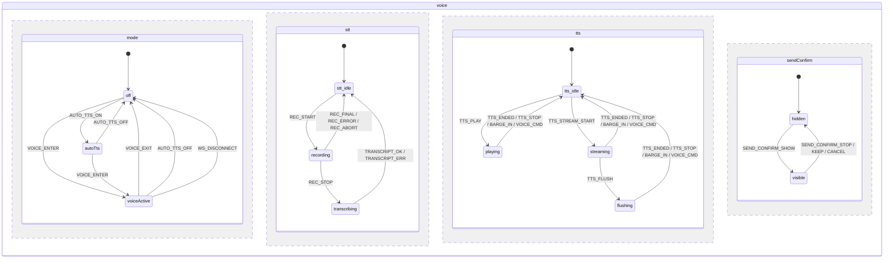
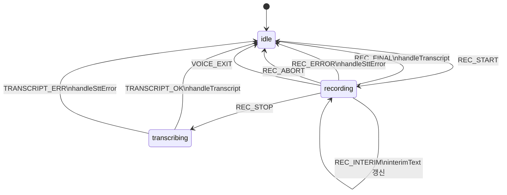
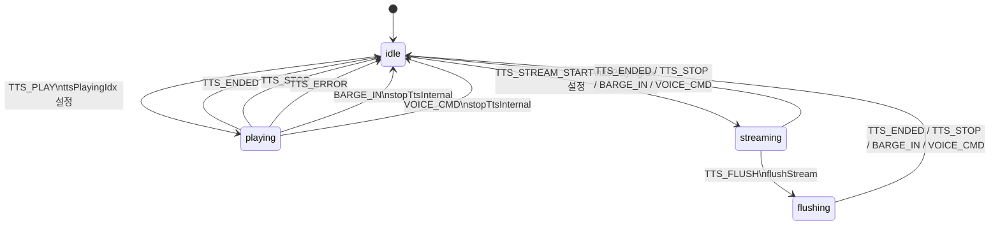
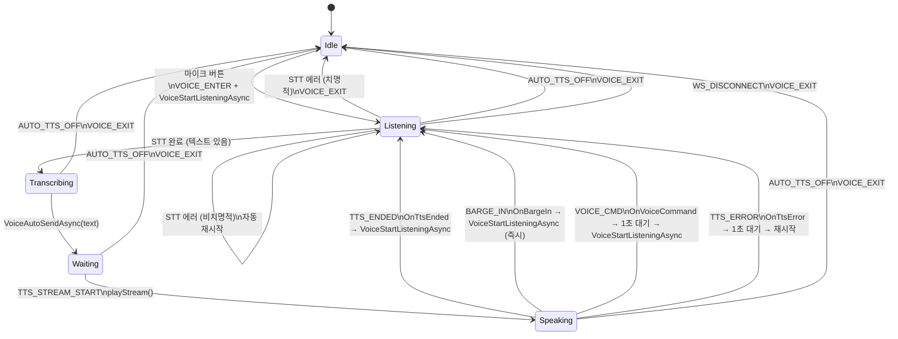
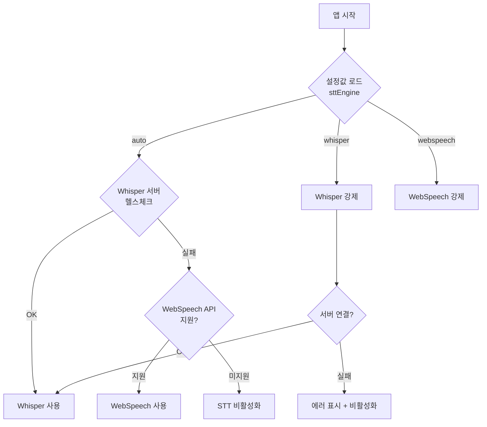
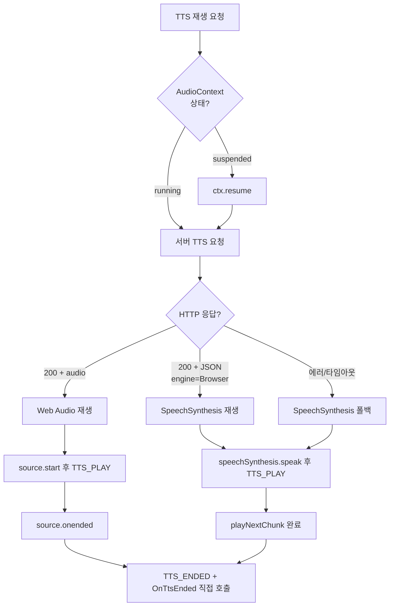

# 음성 입출력 상태 머신 (Voice I/O State Machine)

> FabWise WebClient 음성 대화 기능의 상태 관리 문서
> 대상 파일: `Index.razor`, `_Layout.cshtml`, `voice-machine.js`

---

## 1. 아키텍처 개요

음성 I/O는 **XState v5 병렬 상태 머신**(`voice-machine.js`)과 **Blazor C# 상태 변수**(`Index.razor`)의
이중 레이어로 관리된다.

```
┌─────────────────────────────────────────────────┐
│  Blazor C# (Index.razor)                        │
│  - _isVoiceMode, _voicePhase, _ttsPlayingIdx    │
│  - UI 렌더링, 사용자 인터랙션, WebSocket 통신    │
│  - voiceMachine.send() 로 JS 상태 머신에 이벤트  │
└──────────────┬──────────────────────────────┬────┘
               │ JSInvokable callbacks        │ JS Interop calls
┌──────────────▼──────────────────────────────▼────┐
│  XState v5 State Machine (voice-machine.js)      │
│  - 4개 병렬 리전: mode, stt, tts, sendConfirm   │
│  - barge-in 수명주기 관리 (entry/exit actions)   │
│  - 마이크/오디오 리소스 조율                      │
└──────────────┬──────────────────────────────┬────┘
               │                              │
┌──────────────▼────┐  ┌─────────────────────▼────┐
│  fabTts            │  │  audioRecorder           │
│  (_Layout.cshtml)  │  │  (_Layout.cshtml)        │
│  - TTS 재생/중지   │  │  - STT 녹음/전사         │
│  - Web Audio API   │  │  - Whisper / WebSpeech   │
└───────────────────┘  └──────────────────────────┘
```

### 파일 구조

| 파일 | 역할 |
|---|---|
| `wwwroot/js/xstate.min.js` | XState v5 UMD 번들 (벤더링, 46KB) |
| `wwwroot/js/voice-machine.js` | 상태 머신 정의 + barge-in 감지기 |
| `Pages/_Layout.cshtml` | `fabTts` (TTS), `audioRecorder` (STT) 구현 |
| `Pages/Index.razor` | Blazor 컴포넌트 — UI + 비즈니스 로직 |

---

## 2. XState 병렬 상태 머신

### 2-1. 머신 구조



### 2-2. 컨텍스트 (Context)

| 키 | 타입 | 설명 |
|---|---|---|
| `autoTtsEnabled` | `boolean` | Auto TTS 활성화 여부 |
| `ttsPlayingIdx` | `number` | 재생 중 메시지 인덱스 (`-1` = 없음) |
| `interimText` | `string` | STT 중간 결과 텍스트 |
| `recordingSeconds` | `number` | 녹음 경과 시간 |
| `pendingMessage` | `string\|null` | TTS 중 전송 확인 대기 메시지 |
| `sttEngine` | `string` | STT 엔진 (`'whisper'` / `'webspeech'`) |

---

## 3. Mode 리전 (음성 모드)

### 상태 전이

| 이벤트 | off → | autoTts → | voiceActive → |
|---|---|---|---|
| `AUTO_TTS_ON` | autoTts | — | — |
| `AUTO_TTS_OFF` | — | off | off |
| `VOICE_ENTER` | voiceActive | voiceActive | — |
| `VOICE_EXIT` | — | — | off |
| `WS_DISCONNECT` | — | — | off |

### Entry / Exit 액션

| 상태 | Entry | Exit |
|---|---|---|
| `autoTts` | `unlockAudio`, `prepareMic` | `releaseMic` |
| `voiceActive` | `unlockAudio`, `acquireVoiceModeMic` | `releaseVoiceModeMic`, `stopAllActivity` |

### C# 연동

```csharp
// Auto TTS 토글
await JS.InvokeVoidAsync("voiceMachine.setContext", "autoTtsEnabled", _autoTtsEnabled);

// Voice Mode 진입 (ToggleRecording 내)
await JS.InvokeVoidAsync("voiceMachine.send", "VOICE_ENTER");

// Voice Mode 퇴출
await JS.InvokeVoidAsync("voiceMachine.send", "VOICE_EXIT");
```

---

## 4. STT 리전 (음성 인식)

### 상태 전이



### 이벤트 파라미터

| 이벤트 | params | 설명 |
|---|---|---|
| `REC_INTERIM` | `{ text }` | 중간 인식 결과 |
| `REC_FINAL` | `{ text }` | 최종 인식 결과 (WebSpeech) |
| `REC_ERROR` | `{ error }` | STT 에러 메시지 |
| `TRANSCRIPT_OK` | `{ text }` | Whisper 전사 결과 |
| `TRANSCRIPT_ERR` | `{ error }` | Whisper 전사 에러 |

---

## 5. TTS 리전 (음성 합성)

### 상태 전이



### Entry / Exit 액션 (Barge-in 수명주기)

| 상태 | Entry | Exit |
|---|---|---|
| `idle` | `assign({ ttsPlayingIdx: -1 })` | — |
| `playing` | `startBargeIn` | `stopBargeIn`, `notifyTtsState` |
| `streaming` | `startBargeIn` | `stopBargeIn`, `notifyTtsState` |
| `flushing` | `startBargeIn` | `stopBargeIn`, `notifyTtsState` |

### TTS 종료 이중 보장 (Dual Notification)

TTS 종료 시 Blazor에 확실히 통지하기 위해 **이중 경로**를 사용:

```
                     ┌─ voiceMachine.send('TTS_ENDED') → 머신 내부 상태 전이
source.onended ──────┤
                     └─ dotNetRef.invokeMethodAsync('OnTtsEnded') → Blazor UI 갱신
```

**이유**: 머신이 이미 `idle` 상태이면 `TTS_ENDED` 이벤트가 무시되어 Blazor 콜백이
호출되지 않는 에지 케이스 방지. C# `OnTtsEnded()`는 idempotent하게 구현.

```csharp
[JSInvokable]
public void OnTtsEnded()
{
    // 이미 처리된 경우 (OnBargeIn/OnVoiceCommand가 먼저 호출) 스킵
    if (_ttsPlayingIdx < 0 && !_ttsStreamingActive && !_ttsLoading) return;
    _ttsPlayingIdx = -1;
    _ttsStreamingActive = false;
    _ttsLoading = false;
    // ... voice mode 시 VoiceStartListeningAsync() 호출
}
```

### TTS 이벤트 발생 시점 (_Layout.cshtml)

| JS 함수 | 이벤트 | 시점 |
|---|---|---|
| `fabTts.play()` | `TTS_PLAY` | `source.start()` 이후 (오디오 재생 시작 후) |
| `fabTts.playStream()` | `TTS_STREAM_START` | 함수 진입 시 (스트리밍 준비) |
| `fabTts._playSpeechSynthesis()` | `TTS_PLAY` | SpeechSynthesis 시작 시 |
| `fabTts.stop()` | `TTS_STOP` | `_stopInternal()` 호출 후 |
| `source.onended` 등 4개 콜백 | `TTS_ENDED` | 오디오 실제 종료 시 |

---

## 6. SendConfirm 리전 (TTS 중 전송 확인)

| 이벤트 | params | 전이 | 액션 |
|---|---|---|---|
| `SEND_CONFIRM_SHOW` | `{ text }` | hidden → visible | `pendingMessage` 설정 |
| `SEND_CONFIRM_STOP` | — | visible → hidden | `OnSendConfirm(true, text)` |
| `SEND_CONFIRM_KEEP` | — | visible → hidden | `OnSendConfirm(false, text)` |
| `SEND_CONFIRM_CANCEL` | — | visible → hidden | `pendingMessage = null` |

---

## 7. Barge-in 감지 시스템

voiceMachine의 TTS 상태 entry/exit 액션으로 수명주기가 관리된다.

### 구성

```
startBargeIn() ─── TTS 상태 entry 시 호출
  ├── _startRmsDetector()    → AudioContext + AnalyserNode
  └── _startCommandListener() → WebSpeech continuous 모드

stopBargeIn()  ─── TTS 상태 exit 시 호출
  ├── _stopRmsDetector()     → AudioContext.close()
  └── _stopCommandListener() → SpeechRecognition.stop()
```

### RMS 감지기

| 항목 | 값 |
|---|---|
| 임계값 | RMS > 0.02 |
| 확인 시간 | 300ms 연속 |
| 샘플링 주기 | 40ms (setInterval) |
| 이벤트 | `BARGE_IN` |

### 음성 명령 리스너

| 항목 | 값 |
|---|---|
| 엔진 | WebSpeech API (continuous) |
| 언어 | `ko-KR` |
| 명령어 | `멈춰`, `그만`, `중지`, `스톱`, `stop` 등 9개 |
| 에코 필터 | 인식 텍스트 > 15자 → TTS 에코로 간주, 무시 |
| 이벤트 | `VOICE_CMD { command: 'stop' }` |

### BARGE_IN vs VOICE_CMD 차이

| 항목 | `BARGE_IN` (RMS) | `VOICE_CMD` (WebSpeech) |
|---|---|---|
| 트리거 | 아무 소리 300ms 지속 | 특정 명령어 인식 |
| TTS 중지 | `stopTtsInternal` | `stopTtsInternal` |
| Voice Mode → 녹음 재시작 | 즉시 (사용자가 말하는 중) | 1초 대기 후 (명령 에코 방지) |
| Non-Voice Mode | TTS 중지만 | TTS 중지만 |
| Blazor 콜백 | `OnBargeIn()` | `OnVoiceCommand("stop")` |

### 마이크 스트림 우선순위

```
persistentStream (Voice Mode) > bargeInMicStream (Auto TTS) > 없음
```

---

## 8. Blazor ↔ JS 연동

### 초기화 (OnAfterRenderAsync)

```csharp
_dotNetRef = DotNetObjectReference.Create(this);
await JS.InvokeVoidAsync("voiceMachine.init", _dotNetRef);  // machine에 Blazor ref 전달
await JS.InvokeVoidAsync("audioRecorder.init", _dotNetRef, EquipmentId);
```

### JS → Blazor 콜백 (JSInvokable)

| 메서드 | 호출자 | 설명 |
|---|---|---|
| `OnTtsEnded()` | TTS 종료 콜백 (직접) | TTS 종료 — idempotent |
| `OnTtsError(error)` | voiceMachine 액션 | TTS 에러 |
| `OnBargeIn()` | voiceMachine 액션 | RMS barge-in 감지 |
| `OnVoiceCommand(cmd)` | voiceMachine 액션 | 음성 명령 감지 |
| `OnTranscriptionComplete(text)` | audioRecorder / voiceMachine | STT 완료 |
| `OnTranscriptionError(error)` | audioRecorder / voiceMachine | STT 에러 |
| `OnSendConfirm(stop, text)` | voiceMachine 액션 | TTS 중 전송 확인 |

### Blazor → JS 이벤트 전송

| C# 코드 | 머신 이벤트 | 시점 |
|---|---|---|
| `voiceMachine.setContext("autoTtsEnabled", true/false)` | `AUTO_TTS_ON`/`OFF` | ToggleAutoTts |
| `voiceMachine.send("VOICE_ENTER")` | `VOICE_ENTER` | 마이크 버튼 (Voice Mode 진입) |
| `voiceMachine.send("VOICE_EXIT")` | `VOICE_EXIT` | ExitVoiceModeAsync |

---

## 9. C# 레이어 상태 변수

> XState 머신과 병렬로 C# 상태 변수가 여전히 사용됨 (점진적 마이그레이션 중).

| 변수 | 타입 | 설명 |
|---|---|---|
| `_autoTtsEnabled` | `bool` | Auto TTS 토글 (localStorage 저장) |
| `_isVoiceMode` | `bool` | 음성 대화 루프 활성 |
| `_voicePhase` | `VoicePhase` | 음성 모드 세부 단계 |
| `_isRecording` | `bool` | 마이크 녹음 중 |
| `_isTranscribing` | `bool` | STT 변환 중 |
| `_ttsPlayingIdx` | `int` | TTS 재생 중 메시지 인덱스 (`-1` = 없음) |
| `_ttsStreamingActive` | `bool` | 스트리밍 TTS 진행 중 |
| `_ttsLoading` | `bool` | TTS 로딩 중 |

### VoicePhase 열거형

```csharp
private enum VoicePhase { Idle, Listening, Transcribing, Waiting, Speaking }
```

| Phase | 의미 | UI 표시 |
|---|---|---|
| `Idle` | 비활성 | 상태 바 숨김 |
| `Listening` | 마이크 대기/녹음 중 | 녹색 맥동 아이콘 + "듣고 있습니다..." |
| `Transcribing` | STT 텍스트 변환 중 | 처리 중 애니메이션 |
| `Waiting` | AI 응답 대기 | 처리 중 애니메이션 + "응답 생성 중..." |
| `Speaking` | TTS 응답 재생 중 | 파란 스피커 아이콘 + "응답 읽는 중..." |

---

## 10. Voice Mode 전체 흐름 (E2E)



---

## 11. STT 엔진 선택 흐름



---

## 12. TTS 재생 엔진 폴백 흐름



---

## 13. 에러 처리 정책

### STT 에러

| 에러 유형 | 분류 | 처리 |
|---|---|---|
| `aborted` | 정상 | 무시 (사용자 수동 중지) |
| `no-speech` | 비치명적 | Voice Mode: 자동 재시작 / 일반: 무시 |
| `network` | 비치명적 | Voice Mode: 자동 재시작 / 일반: 무시 |
| `not-allowed` | 치명적 | UI 에러 표시 |
| 서버 연결 실패 | 치명적 | UI 에러 표시 + Voice Mode 종료 |

### TTS 에러

| 에러 유형 | 처리 |
|---|---|
| 서버 TTS 실패 | SpeechSynthesis 폴백 |
| SpeechSynthesis 실패 | `OnTtsError` → Voice Mode: 재시작 / 일반: 무시 |
| AudioContext suspended | `resume()` 시도 → 실패 시 폴백 |

---

## 14. 테스트

`tests/voice-machine.test.js` — Node.js 기반 XState v5 머신 테스트 (78개).

```bash
cd src/Client/FabCopilot.WebClient
npm install   # xstate@5 설치
node tests/voice-machine.test.js
```

### 테스트 범위

| 카테고리 | 수 | 내용 |
|---|---|---|
| 초기 상태 | 2 | 4개 병렬 리전 초기값, context 초기값 |
| Mode 전이 | 8 | off↔autoTts↔voiceActive, entry/exit 액션 |
| STT 전이 | 10 | idle↔recording↔transcribing, 모든 이벤트 |
| TTS 전이 | 12 | idle↔playing↔streaming↔flushing, 모든 이벤트 |
| Send Confirm | 4 | show/stop/keep/cancel 전이 |
| 병렬 독립성 | 3 | 리전 간 간섭 없음 검증 |
| E2E 사이클 | 3 | 전체 음성 루프, barge-in, voice command |
| 버그 회귀 | 6 | TTS_ENDED 이중 호출, idle 무시, stopTtsInternal 누락 |
| v5 시그니처 | 10 | `assign({ event })`, `({ context })` 디스트럭처링 |
| Barge-in 수명주기 | 4 | entry/exit 시점, streaming→flushing 재시작 |
| 액션 실행 순서 | 2 | exit → transition → entry 순서 보장 |
| Context 무결성 | 4 | ttsPlayingIdx 리셋, interimText 초기화 |
| 스트레스 | 3 | 1000회 TTS, 500회 voice mode, 500회 혼합 |
